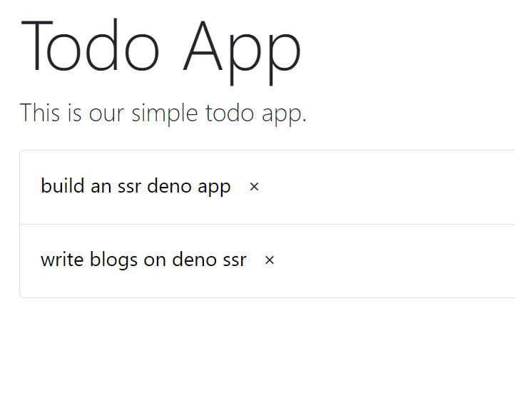
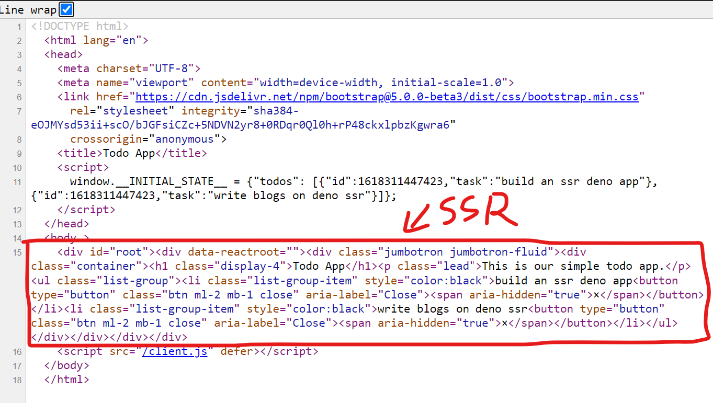

# Deno SSR React Example

**Deno application with react and server side rendering**

* Uses esm to resolve react, react-dom and react-dom-server for types
* Uses Oak framework backend api

## Requirements

This assumes that user has Deno and Deno extension for visual studio code already setup

## Instructions

```sh
make bundle # to output client bundle
make run # start application

http://localhost:8000 # app url

# Add more todos
curl --header "Content-Type: application/json" --request POST --data '{"task":"Create postman script"}' http://localhost:8000/todos/
```

## Screenshots





## References

*Outdated but still useful articles*

1. https://dev.to/ije/introducing-esm-cdn-for-npm-deno-1mpo
2. https://decipher.dev/deno-by-example/advanced-react-ssr/

## TODO

- [ ] Clean code, many bad practices

## Bugs

Currently, there is a warning related to `deno.window` in tsconfig which is known issue with Deno team as typescript compiler in vscode failed to recognise this literal and gives an error. Work around is not to use `tsconfig.json` file but still gives warning
